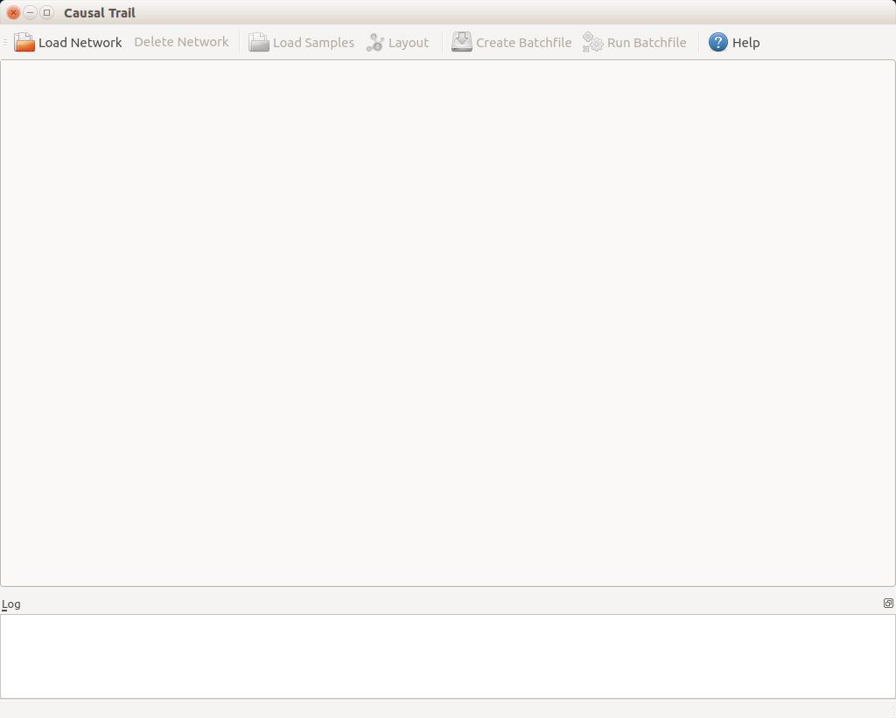
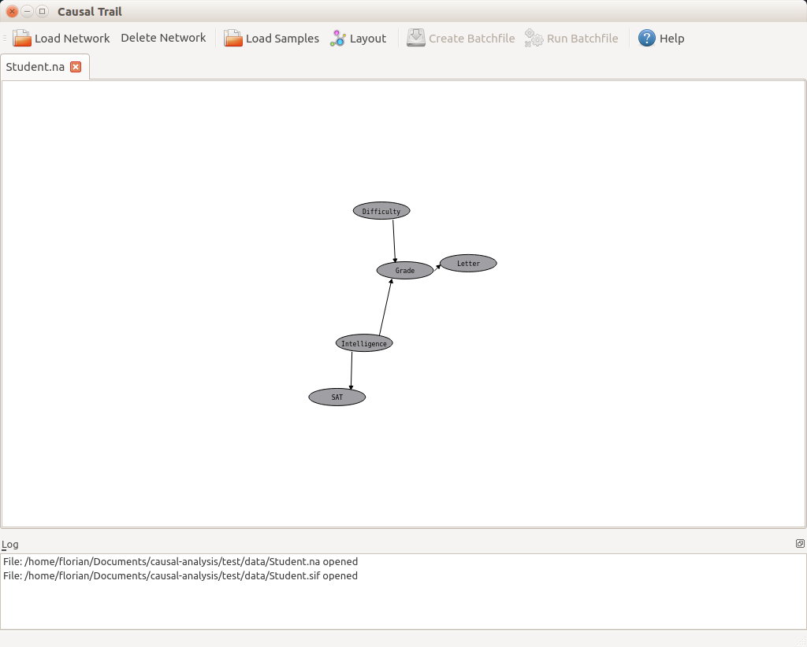
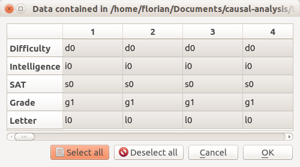
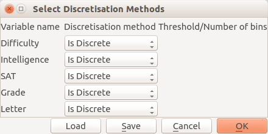
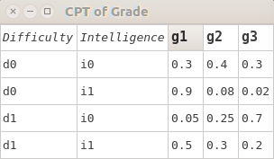
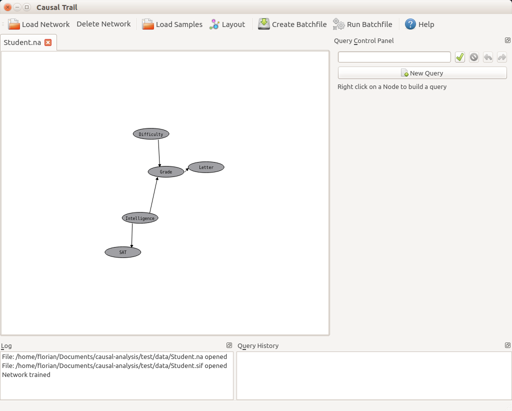
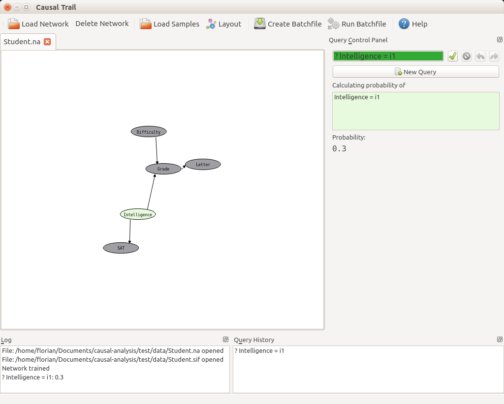
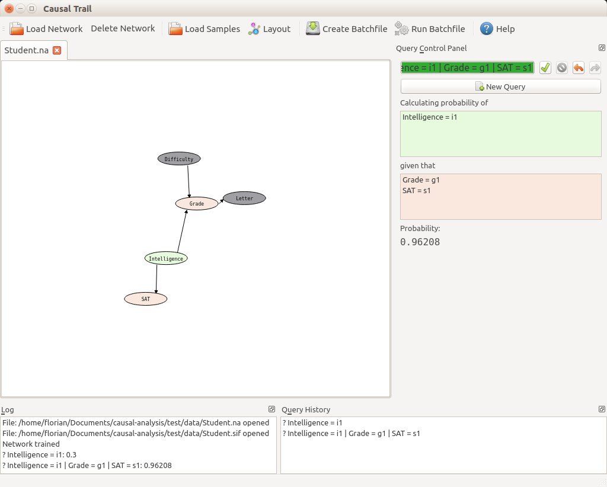
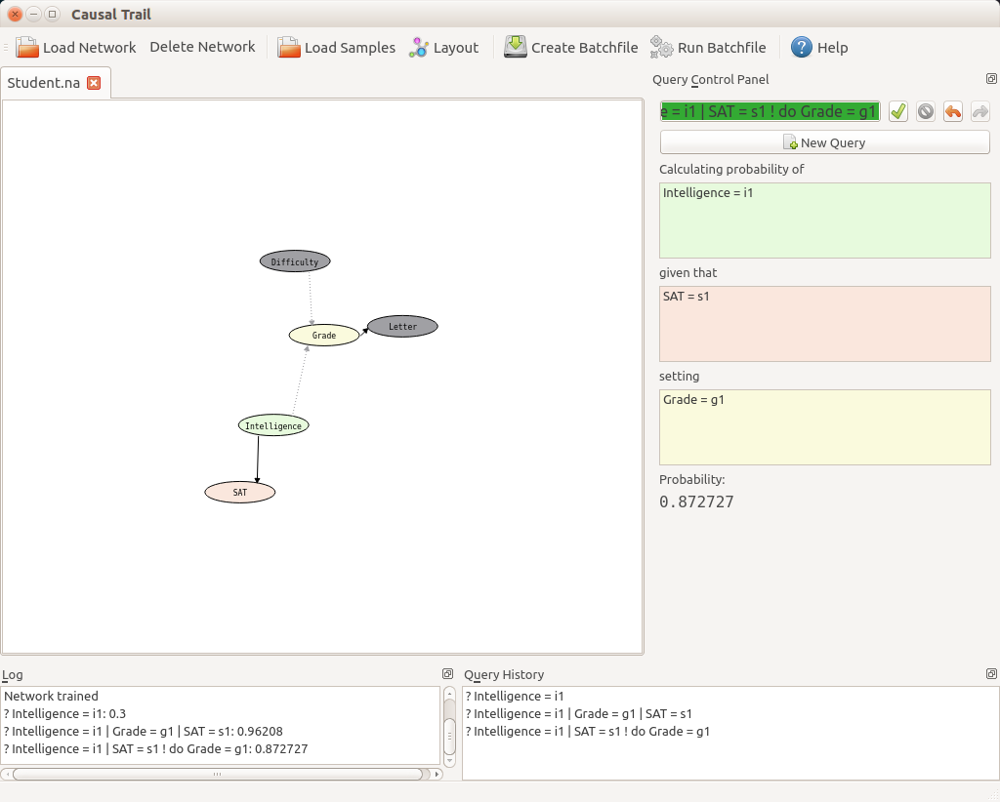
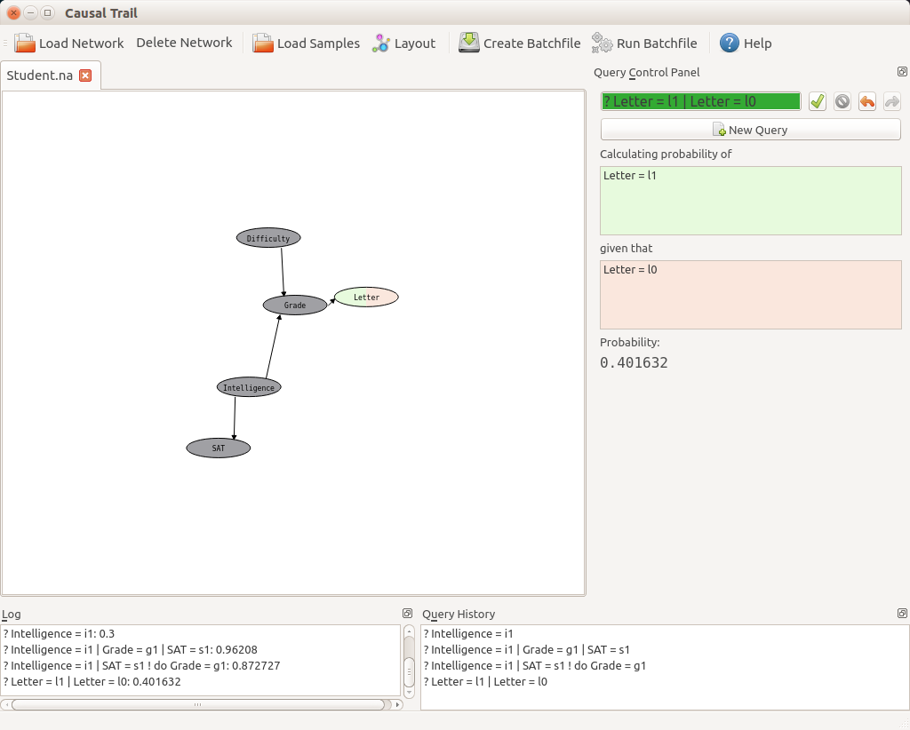

# CausalTrail #
**CausalTrail** is a tool for causal hypotheses testing using *causal bayesian networks (CBN)* and the *do-calculus*.

**CausalTrail** can be executed either from the console or via a graphical user interface.

## Build ##
**CausalTrail** can be build using `cmake`.

###Mandatory Dependencies###
The *Boost* library as well as a *C++* compiler supporting *C++14* have to be available to build the console version of **CausalTrail**.

###Optional Dependencies###
To build **CausalTrails** tests *gtest* is required. To build the gui, *Qt* version *5.4* or higher has be installed.

###Step By Step Build Commands###
Enter **CausalTrails** directory and execute the following:

    mkdir build

	cd build

	cmake ..

If the path to *gtest* can not be found automatically, specify it via

     cmake . -DGTEST_SRC_DIR=<path>

If the path to *Qt* can not be found automatically, specify it via

     cmake . -DQt5Widgets_DIR=<path>
    
Build the project by typing 

    make

To use multiple cores (e.g. 4) for building use the `-j` option:

	make -j 4

The executable file for the consol version is located in the folder `build/core`, the gui version is located in the folder `build/gui`, and the tests can be found in the folder `build/test`.

## Execution ##

To run **CausalTrails** tests type

	make test

The *console* version of **CausalTrail** can be evoked with the command

	./CausalTrail <Observations.txt> <Discretisation_Information.json> <Network.tgf>

or alternatively

	./CausalTrail <Observations.txt> <Discretisation_Information.json> <Network.sif> <Network.na>

We provide details on the input files in the next section.

The *gui* can be launched with 

	./CausalTrailGui 

## Data Formats ##
###Network Files###
We support two kinds of network formats: the *trivial graph format (tgf)* and the *simple interaction format (sif)* along with node *node atrribute (na)* files.

####Trivial Graph Format####

The *tgf* format has the following structure:

    
    NodeID NodeAttribute
    
    ...
    
    #
    
    NodeID NodeID EdgeAtribute

The upper part of a *tgf* file contains the mapping between node identifiers and at most one optional attribute, e.g. node names. The # marks the beginning of the actual network definition. Edges are directed from the first to the second node identifier. An edge between two nodes can be mapped to at most one optional attribute.

####Node Attribute Format####
*Node attribute* files have the following structure:

	AttributeName (class = Type)
	NodeID =	NodeAttribute
	...

Different node attribute classes can be referenced via the *AttributeName*. *Type* states the data type of the node attributes. The mapping of *NodeID* to *NodeAttribute* has to be unique within one class of attributes.  

####Simple Interaction Format####
The *simple interaction format* is structured as follows:

	...
	NodeID EdgeType NodeID
	...

Nodes in the network are identified via the *NodeID*. Therefore, the *NodeIDs* have to be unique. The left *NodeID* represents the source of an edge, the right on represents the target. It is possible to assign more than one target node to a distinct source node, so multiple edges can be stored in one line. The *EdgeType* encodes the type of an edge, e.g. whether an edge between two nodes is directed or not. It is also common to encode biological meaning in the *EdgeType*. For example, *pd* represents Protein-DNA interactions, whereas *pp* represents Protein-Protein interactions. The *EdgeType* can also be a longer string, allowing the encoding of more complex descriptions, e.g. *activates*, *inactivates*, or *phosphorylates*. If it is not necessary to encode any specific meaning for an edge *xx* or *yy* can be used as an *EdgeType*.

----------

###Data Files###
The samples upon which we learn the causal bayesian network should be provided in a *tab-delimited* txt file where the columns are the samples and the rows are the features. An example is shown below.
	
	SNV1		Yes	No	Yes	No
	SNV2		No 	No	No	Yes
	Expression	1.7	1.2	1.4	0.6

###Discretisation Information###
We provide several discretisation methods within **CausalTrail**.

Using a simple *json* file, the user can control the discretisation process. For example:

	{
		"SNV1":
		{
		"method":"None",
		},
		"SNV2":
		{
		"method":"None",
		},
		"Expression":":
		{
		"method":"Threshold",
		"threshold": "1.0"
		}
	}

For every node in the network, the *method* field specfies the discretisation method. If necessary, additional fields can be used to provide specific information that is needed for the discretisation, e.g. a manually determined threshold as shown in the example above.  A list of all keywords and discretisation methods is shown below.

- *Floor*: Round the data to the next smaller integer value.
- *Ceil*: Round the data to the next larger integer value.
- *Round*: Round the data.
- *ArithmeticMean*: Divide the data into two groups according to the arithmetic mean.
- *HarmonicMean*: Divide the data into two groups according to the harmoinc mean.
- *Median*: Divide the data into two groups according to the median.
- *Threshold*:
	- Divide the data into two groups according to a manually defined threshold.
	- The actual threshold is specified in the field *threshold*. 
- *BracketMedians:* 
	- Discretise the data according to the bracket medians method.
	- The number of buckets is specified in the field *buckets*.
- *PearsonTukey*: Discretise the data according to the Pearson Tukey method.
- *Z-Score*: Divide the data into two groups according to the Z-Score.
- *None*: The data is already discret.
 
## GUI Usage ##
The initial layout of **CausalTrails** gui is shown below. At the bottom of the window, there is a dock widget containing general information on the current session, labelled *Log*. As we see later, the middle area is used for network visualisation and query managment. At the top, there is a toolbar allowing direct access to the most important actions. Buttons are enabled according to the current status of a session. Thus, errors caused by wrong user input can be avoided. In addition to the toolbar, there is a menubar allowing access to all functions of **CausalTrail**. 

In the following we provide step by step guidlines on how to use our tool. For illustration purposes, we use the *Student Network* presented in *Probabilistc Graphical Models* by *Koller and Friedman*.

###Network Managment###
Networks can be loaded by a click on *Load Network* in the toolbar or by clicking on *Network -> Load Network* in the menu. A dialog will be shown to select networks represented in the formats introduced above. The dialog can also be opened by pressing *Strg + O*.

Upon loading, the network layout is computed using *graphviz*. If *graphviz* is not available, the layout is generated by a force directed layouting algorithm included in **CausalTrail**. 

The network view is interactive, e.g. it is possible to move nodes or to zoom in or out the network visualisation. 
By clicking on *Layout* in the toolbar, the menubar or by pressing *Strg + L*, the network is layouted again. 

Networks are visualised in a *tab* window. In case that the user loads multiple networks, each network is shown in its own tab. Using **CausalTrails** *svg* export function, a network visualisation can be exported to a *svg* file. To do so, click *Network -> Export SVG*.

A click on *Delete Network* deletes the network that is currently shown. This can also be done with *Strg + D*.

An example of the visualisation of the *Student Network* is depicted below. 

To load the *Student Network*, use the files:
	
	test/data/Student.na
	test/data/Student.sif

###Loading Samples and Training the Network
To load samples, click on *Load Samples* in the toolbar or in the menu. Once a suitable file is choosen, the data is shown in a table allowing manual inspection of the data as well as (de)selection of individual samples. This allows the exclusion of distinct samples from the analysis. 
An example for the student network is shown below.

Upon confirming the data by a click on *OK*, a window for selection of discretisation methods is shown. 

Here, the user has two options: Either the discretisation information is loaded from a existing *json* file, or it is specified using the interface.
A *json* file can be loaded by clicking on *Load*. 
In order to simplify the discretisation step, manually specified discretisation information can be stored in a *json* file by clicking on *Save*.
As soon as the discretisation information is specified, the user can continue with parameter learning by clicking *OK*.

During parameter learning the *conditional probability tables (cpt)* for all nodes are computed. It is possible to look at the individual cpts of each node by right clicking on a node and selecting *Show CPT* in the popmenu. 

Once the learning is completed, two new dock widgets are shown, the *Query History* and the *Query Control Panel*.

The *Query History* lists all submitted and valid queries for individual networks. The *Query Control Panel* is used in formulating queries. We provide several examples for query managment in the next section.

To train the *Student Network* use the files:

	test/data/StudentData.txt
	test/data/controlStudent.json

###Query Managment###
####Overview####
**CausalTrail** offers four ways to submit a query:

1. A query can be entered directly, as in the console version of **CausalTrail**.
2. A query can be entered interactively.
3. A query can be chosen from the *Query History*.
4. Several queries can be executed using a *Query Batch File*.

####Direct Query Formulation####
Queries can be entered directly into the Edit field at the top of the *Query Control Panel*. Correctness of queries is checked while typing. The background color of the Edit field switches to green if the query is correct and to red otherwise. Queries can be submitted by a click on the green tick next to the Edit field or by pressing *Enter*.

Entering queries directly requires the user to be familiar with our query language in detail. As this can not be expected from the general user, we offer an interactive query construction introduced in the next section. 

####Interactive Query Formulation####
To facilitate the formulation of queries, **CausalTrail** supports interactive query construction. To build a query, the user has to move the mouse over a node of interest and perform a right click on it. A context menu allowing the following operations is shown:

1.	*Probability of*: Calculates the probability that this node obtains the specified value.
2.	*Arg Max*: Calculates the most likely value assignment for this node. Note that it is not possible to combine (1) and (2) in one query.
3.	*Condition on*: Calculates the conditional probability of other nodes given the specified value of the currently selected node.
4.	*Set value to*: Perform a *do-intervention* on the current node. The edges to the nodes parents are deleted and its own value is fixed to the selected value. 
5.	*Add Edge to*: Adds an edge to another node. To add a new edge double click on the desired target node. The added edge will appear in red. If the new edge would induce a cycle, an error will be shon in the *Log*. Adding an edge causes retraining of the entire network. 

Once an item is selected, it is shown in one of the boxes in the *Query Control Panel*. A colour code and a natural language wrapper around the query item boxes help to understand the query. Double clicking on an item in the *Query Control Panel* removes it from the current query. 

In addition to the operations on nodes, there is an operation on edges. A right click on an edge opens a context menu allowing to remove the selected egde. Removed edges are shown in grey.  As for adding an edge, removing one causes retraining of the network too. 

####Query History####
The query history enables the user to reload a previously submitted query. There are two ways to do this:

1. A query can be directly selected via a double click in the *Query History*.
2. Using the *Back* and *Forward* arrows next to the query Edit field one can go stepwise forward or backward in query history. 

####Query Batch Files####
To permit the user to quickley process a set of queries on networks trained on different data sets, **CausalTrails** offers *Query Batch Files*. A batch file containing all queries currently shown in the *Query History* can be created by clicking on *Create Batchfile*. It can be executed by a click on *Execute Batchfile*. Results are shown in the *Log*.

####Examples####
To illustrate the usage of **CausalTrail** further, we present a few example queries in the *Student Network*.

#####Predictions######
In this example, we compute the probability that *Intelligence* obtains the value *i1*.

In the second example, we compute the probability that *Intelligence* obtains the value *i1* if *Grade* has value *g1* and *SAT* has value *s1*.

#####Interventions#####
Here, we compute the probability that *Intelligence* obtains the value *i1*, if we perform a *do-intervention* on *Grade*, setting its value to *g1* and given that *SAT* has value *s1*.

#####Counterfactuals#####
In the last example, we compute the probability to get a letter, if we have not reveived a letter before. 

###Sessions###
To avoid repeating the process of network and sample loading, **CausalTrail** supports sessions. A session in **CausalTrail** contains all currently trained networks and submitted queries. To save a session, click on *Save Session* in the toolbar or click *File -> Save Session* in the menu. A session can be restored by a click on *Load Session* in the toolbar or by clicking *File -> Load Session* in the menu. 
